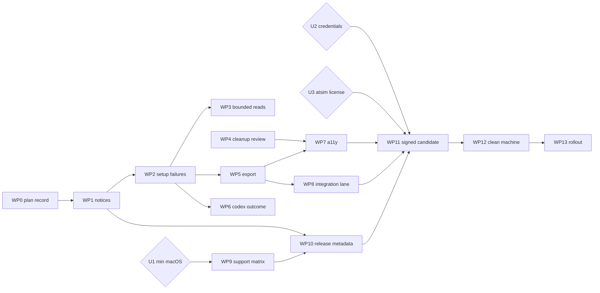

# Milestone: reliable, installable macOS beta

Status: planning record, written 2026-09-22 against `main` `45293d38c7ceb69630444050aaa73afdd507f290`. This document authorizes nothing by itself. Each work package (WP) states whether it can proceed autonomously or needs credentials, a physical device, service terms, or explicit release authorization. CI success, a built DMG, or an uploaded artifact is never release acceptance; only the evidence named per WP is.

Out of scope for this milestone: iOS, any backend or hosted service, application submission, the interview voice pilot (P0–P5 of the 2026-09-18 plan), MCP/Apps SDK, public plugin-directory submission, Sonar activation, CodeRabbit, and feature expansion beyond what the WPs name.

## 1. Starting point (verified 2026-09-22)

### 1.1 Closeout state

| Item | Observed |
| --- | --- |
| Final closeout head | `main` = `45293d38c7ceb69630444050aaa73afdd507f290` (merge of PR #7, 2026-09-22 13:39 UTC); tree clean, in sync with `origin/main`; no open PRs or issues |
| Merged PRs | #1 Claude workflows, #2/#5 Dependabot action bumps, #3 correctness remediation, #4 exact tracker binding, #6 recoverable first-use tracker + closeout record, #7 Xcode 27 coverage export |
| CI on the final head | run 35734968049: "Repository checks" ✅, "Build, test and release contracts" ✅ (macos-15, Xcode 26.3, Swift 6.2.4, arm64) |
| Local re-verification | macOS 27.0 / Xcode 27.0 / Swift 6.4 arm64: `swift test` 178 passed, 3 opt-in skips, 0 failures; `test_cli.py` 4 passed; release-script/tooling suite 61 passed, 4 CLI opt-in skips; `bash -n scripts/*.sh` clean; committed-range whitespace check clean |
| Branch protection | ruleset "Main review and verified checks" active: PR required, review threads resolved, required checks "Repository checks" and "Build, test and release contracts", no bypass actors |
| Environments | `claude` (required reviewers), `release` (required reviewers + branch policy), `sonar` (branch policy) |
| Secrets | repository: `CLAUDE_CODE_OAUTH_TOKEN` only; `release` environment: none. No Apple signing or notarization credentials anywhere |
| Local signing | 0 valid code-signing identities on the dev machine; no `notarytool` keychain profile |
| Release pipeline | `.github/workflows/beta-release.yml` has never run. It signs, notarizes, staples, mounts the DMG read-only and runs `spctl`, then uploads a 90-day Actions artifact. It never creates a GitHub Release, tag, or tap commit |
| Prior beta | GitHub prerelease `v0.1.0-beta` (tag `c45ae21`, 2026-05-18, ancestor of main) with `NavCenter-0.1.0-beta-macos-arm64.dmg` + `.sha256`; notes say "Notarization/stapling still required" |
| Homebrew tap | `subdepthtech/homebrew-nav-center` `Casks/nav-center.rb` version `0.1.0-beta`, sha256 equals the release checksum, `depends_on macos: :ventura`, `arch: :arm64`; caveat claims "Developer ID signed, notarized, and stapled", which contradicts the release notes |
| Sonar | workflow published, skipped on every run because `SONAR_ENABLED` is unset and the `sonar` environment has no secrets; documented as nonrequired |
| Open from the 2026-09-18 plan | A3 cleanup trigger preflight (only on restore), A4 full cleanup review list (`prefix(8)`), A5 eight unbounded reads plus dead paths, A6 Codex automation silently dropped when busy. These were never in the closeout's scope |
| Docs gap | `docs/SETUP.md` closeout record lists PRs #4–#6 only; PR #7 and the final head are unrecorded (fixed alongside this document) |

Closeout verdict: complete for its stated scope (hardening baseline, protection, tracker fixes, coverage export). It is not incomplete in a way that blocks this milestone. The A3–A6 items are adopted below deliberately, in the WPs whose user outcome they affect (cleanup/recovery, Codex acceptance, robustness), not as silent remediation.

### 1.2 What the app is today (facts that shape the WPs)

- First launch silently creates `~/Library/Application Support/Nav Center/Workspace` (`WorkspaceManager.initializeForPackageBrowsing`); the tracker SQLite file appears on the first status change. Missing tracker is a normal package-only view; unreadable tracker degrades with a warning.
- `navcenterctl doctor` reports workspace directories and counts only. No command or view checks whether atsim, pandoc, pdftotext, Chrome, Ruby, or the Codex CLI are available.
- Missing atsim or export tool surfaces as "ATS scan failed with exit code 127." / "Resume PDF refresh failed with exit code 127." with no tool name, env var, or install hint. Pandoc/pdftotext/Chrome failures name the tool but not the env var. Codex names the problem best.
- A Finder-launched app inherits launchd's PATH; atsim/pandoc/pdftotext resolve through `/usr/bin/env`, so Homebrew installs are not found from an installed bundle. Only the Codex resolver has absolute fallbacks (`/opt/homebrew/bin`, `/usr/local/bin`, `~/.local/bin`).
- Document export and vault sync are permanently disabled in the package action rail ("Reserved for a later confirmed export workflow."); `DashboardParityTests` pins that. Export is reachable only via `navcenterctl export-artifacts`, which has no CLI black-box test.
- Accessibility surface: 9 `accessibilityLabel`, 0 `accessibilityIdentifier`, 0 focus management, 2 keyboard shortcuts, one `CommandGroup` (⌘R), no `Settings` scene (⌘, does nothing), no About/version display. SwiftPM cannot host XCUITest.
- The Interview tab shows "Model: gpt-realtime-2" and an `OPENAI_API_KEY` note for a live session the app does not implement.
- The app writes no logs, UserDefaults, caches, or keychain items. Its only persistent state is the workspace directory (plus an optional user-chosen vault mirror). The uninstall list in `docs/BETA.md` and the cask `zap` name a preferences plist the app never writes.
- Info.plist is generated by `scripts/build-and-run.sh` (bundle id `com.subdepthtech.navcenter`, `LSMinimumSystemVersion` 13.0, `CFBundleShortVersionString` = numeric part of `NAV_CENTER_VERSION`, `CFBundleVersion` = `NAV_CENTER_BUILD`). No entitlements file; not sandboxed; hardened runtime is applied only in `package-beta-dmg.sh --distribution`. Packaging builds the host architecture only (arm64 on the runner), never universal.
- No `LICENSE` or third-party notice ships in the `.app` or DMG. `vendor/atsim/UPSTREAM.md`: upstream declares MIT in `pyproject.toml`, but no standalone LICENSE existed at the snapshot commit; "Confirm and include the appropriate license notice before distribution."
- Opt-in real-tool tests: `NAV_CENTER_TEST_ATSIM_BIN` (2 tests), `NAV_CENTER_TEST_REAL_CHROME=1` (1 test). Nothing exercises real pandoc/pdftotext, `NAV_CENTER_EXPORT_BIN`, or a live Codex session. None run in CI.
- Hosted runners: the `macos-13` image is retired; `macos-14`/`15`/`26` arm64 and `macos-15-intel`/`macos-26-intel` exist. The declared macOS 13 minimum cannot be exercised on hosted CI at all.

## 2. Decisions

### 2.1 Routine decisions taken here (recommendations, change by editing this doc)

| # | Decision | Rationale |
| --- | --- | --- |
| R1 | Beta candidate version `0.1.0-beta.1`, `CFBundleVersion` strictly greater than the installed `v0.1.0-beta` build (read it from the old DMG's Info.plist during WP12 before choosing; use 2 if the old build was 1) | Semver orders `0.1.0-beta < 0.1.0-beta.1`; matches the `RELEASE.md` example; upgrade tests need a monotonic build number |
| R2 | Ship arm64 only in this milestone; state Intel as "not supported in this beta" in README/BETA/cask | Every existing artifact, cask, and workflow is arm64; adding Intel doubles signing, notarization, and clean-machine verification with no tester demand recorded |
| R3 | Distribution path: GitHub prerelease with DMG + `.sha256` is primary; the Homebrew cask is updated only from a notarized, stapled artifact and only after WP12 passes | `beta-release.yml` intentionally has `contents: read`; release creation stays a manual, authorized maintainer step with a runbook |
| R4 | No `Settings` scene; ⌘, routes to the existing sidebar Settings destination | A second Settings window would duplicate state; `DashboardParityTests` pins the sidebar sections |
| R5 | Tool probing never executes a binary; it checks for an executable regular file at a bounded candidate list | `doctor` must stay side-effect free; overrides are user-controlled paths; the functional `--version` check stays behind confirmed actions |
| R6 | Production tool resolution changes to the same resolver `doctor` uses (env override → PATH → fixed fallback dirs) | A diagnostic table that disagrees with what the action runs would be a lie; the Codex resolver already does this |
| R7 | Export becomes reachable from the GUI through the existing confirmation-gated `refresh-resume` runner path; vault sync stays disabled | The GUI's own artifact health checks are otherwise unachievable; the runner already validates fresh `%PDF-` output and rolls back |
| R8 | No keyboard shortcuts for tracker status quick actions | They mutate the tracker without confirmation; a mis-key would change state |
| R9 | Sonar stays off; not part of this milestone | Nothing in the beta gates needs it; onboarding is an owner service decision (`docs/TOOLING.md`) |
| R10 | Build-provenance attestation deferred to the first signed candidate's follow-on, as `docs/RELEASE.md` already states | Adds OIDC write permissions; do it once a real artifact exists |
| R11 | Every code slice is delegated via `python3 ~/.claude/skills/cli-router/scripts/delegate.py` (multi-file implementation row: codex `gpt-5.6-sol` effort `medium`, `--write --reason`; adversarial review: grok `grok-4.6` effort `high`, read-only); Claude Code plans, judges, runs the checks, runs `path-safety-reviewer` for any Core write path, and quotes the ledger row | Global CLAUDE.md delegation rule |

### 2.2 Genuinely unresolved decisions (need the owner)

| # | Decision | Options | Recommendation | Needed by |
| --- | --- | --- | --- | --- |
| U1 | Advertised minimum macOS | (a) keep 13 and test on a physical or VM macOS 13 device; (b) raise to 14 (oldest hosted image) and test 14 in CI; (c) keep 13 advertised but state "tested on 14+" | (b) unless a macOS 13 test device exists. Advertising an untested floor contradicts `RELEASE.md` | WP9 |
| U2 | Apple credentials: Developer ID Application certificate (team `3364PH2HE3` signed the May build; the identity is no longer on this machine) and an App Store Connect API key for notarization, stored only as `release` environment secrets | provision now vs later | Provision before WP11; nothing else is blocked by it | WP11 |
| U3 | atsim license text and copyright holder for `THIRD_PARTY_NOTICES.md` | confirm MIT with upstream and add the text; or keep the placeholder and refuse `--distribution` while pending | Confirm with upstream (the author is the same maintainer); do not invent the text | WP1 / WP11 |
| U4 | Homebrew tap semantics for the beta | keep tap as a documented install path (update cask per beta) vs DMG-only until GA | Keep the tap, but fix the caveat and only publish casks for notarized artifacts (R3) | WP10 |
| U5 | Tester cohort and stop criteria for the controlled rollout | size, channel, what feedback halts distribution | Friends-and-family cohort ≤ 10, feedback via `feedback-diagnostics` output pasted into a private channel; halt on any data-loss or Gatekeeper report | WP13 |
| U6 | Intel support after this beta | none / build on `macos-15-intel` later | Revisit after rollout feedback | after milestone |

## 3. Work packages

Format per WP: outcome and scope; dependencies and PR boundary; acceptance criteria; tests and retained evidence; autonomy. Sizes: S < 1 day, M 1–3 days, L 3–5 days of delegated implementation plus review. No dates are asserted.

### WP0 — Milestone record (this document) — S, docs only

- Outcome: this plan is in the repo and `docs/SETUP.md` points to it and names the final closeout head (PR #7 / `45293d3`).
- PR boundary: `docs/MACOS-BETA-MILESTONE.md`, two lines in `docs/SETUP.md`.
- Acceptance: links resolve; committed-range whitespace check clean.
- Evidence: the PR itself.
- Autonomy: autonomous (planning authorization already given for the document; committing/PR needs the user's go).

### WP1 — Attribution, notices, dependency inventory — S/M

- Outcome: the source tree, the `.app`, and the DMG carry `LICENSE` and `THIRD_PARTY_NOTICES.md`; the release scripts refuse to build a distribution artifact while the atsim notice is unconfirmed; `docs/DEPENDENCIES.md` states exactly what ships versus what is only referenced.
- Scope: new `THIRD_PARTY_NOTICES.md` (Nav Center MIT pointer; atsim section with repo URL, snapshot commit `cc37c5b1e3a4f7dfe17d9f043eb18021ff6faef4`, copy date, "not built, bundled, or executed by Nav Center", the verbatim UPSTREAM.md licensing sentence, and a `PENDING UPSTREAM CONFIRMATION` marker until U3 is resolved; `@opencode-ai/sdk` listed as present in the snapshot lockfile, not installed). `scripts/build-and-run.sh` stages both files into `Contents/Resources` (fail before `swift build` if missing, next to the icon check). `scripts/package-beta-dmg.sh` copies both to the DMG root; `--distribution` exits non-zero if the pending marker is present. `scripts/verify-vendor.py` requires the notices file to reference `vendor/atsim` and the UPSTREAM commit and prints a distinct pending line (exit 0). Update `docs/DEPENDENCIES.md`, `docs/RELEASE.md`, `docs/PUBLIC_RELEASE_CHECKLIST.md`.
- Do not touch: anything under `vendor/atsim` (the inventory hash check must keep passing); signing order; `.github/workflows` (the mount-step assertion `test -f "$MOUNT/THIRD_PARTY_NOTICES.md"` goes in WP10 with the other workflow edits).
- Dependencies: none. PR boundary: scripts + tests + docs + the new notices file.
- Acceptance: `ls "dist/Nav Center.app/Contents/Resources"` shows `LICENSE` and `THIRD_PARTY_NOTICES.md`; a `--local` DMG mounts with both at its root; `python3 -B scripts/verify-vendor.py` prints the pending line; `git diff --stat vendor/` empty; `bash -n scripts/*.sh` and the Python suite green.
- Tests: `scripts/tests/test_release_scripts.py`: `test_build_stages_license_and_notices_into_resources`, `test_build_fails_before_swift_when_license_or_notices_missing`, `test_local_package_places_license_and_notices_beside_app_in_image` (extend the `hdiutil` stub to record the staging listing), `test_distribution_refuses_pending_notice_placeholder`; new `VendorNoticeTests`: `test_notices_reference_snapshot_commit_and_path`, `test_verify_vendor_reports_pending_confirmation_without_failing`. The test `setUp` must copy the two new root files into its sandbox.
- Evidence: PR CI; `verify-vendor.py` output in the PR body.
- Autonomy: autonomous for everything except the license text itself (U3, human).

### WP2 — Understandable setup and dependency failures — L

- Outcome: a fresh install that lacks optional tools tells the user which tool is missing, which env var to set, and how to install it, in `navcenterctl doctor` (human + JSON), in the package action log, and in Settings. Settings shows the app version. Fresh-workspace onboarding is unchanged in behavior but documented in `docs/BETA.md` with the exact first-launch outcome.
- Scope: new `Sources/NavCenterCore/ToolAvailability.swift` with `ExternalTool` (atsim, export-tool, pandoc, pdftotext, chrome, ruby, codex), `ToolState` (found, missing, override-invalid, built-in), `ToolSource` (environment, path, fallback, default-path), `ToolStatus`, `ToolAvailabilityReport` (always all 7, `redacted(homeDirectory:)`), `ToolProbeConfiguration` (injectable environment, home, fallback dirs, executable-file predicate), `ToolProbe.resolve/report/executablePath/missingToolMessage`. Resolution order: env override (absolute → check; bare name → default lookup) → PATH entries → fixed fallbacks `/opt/homebrew/bin`, `/usr/local/bin`, `~/.local/bin` → missing; export-tool without override is built-in; Chrome default is the `/Applications` bundle path. Probe checks `stat` regular file + `access(X_OK)`; never spawns (R5). `PackageActionRunner` and `ArtifactExporter` resolve through the probe (R6); `NativeCodexBridge.resolveCodexCommand` becomes a single call into it; `MasterResumeStore` keeps bare `ruby` (system Ruby is on launchd PATH), probe reports it. Preflight in `PackageActionRunner` only when `commandHook == nil`: ats-scan requires atsim found; refresh-resume requires export-tool found or built-in; failure records `status: failed`, `exitCode: nil`, named message, nothing spawned. Exit 127 with no hook maps to the named message; other codes keep "failed with exit code N". `FeedbackDiagnosticsReport` gains `tools` (redacted paths). `doctor` prints a tool table plus the Finder-PATH sentence; JSON gains `tools`; no new flags, so `ArgumentParser.validate` is untouched. App: `DashboardServicing.fetchToolAvailability()` with an extension default returning `.empty` (existing pattern for `cancelCodexTurn`), store `toolAvailability`, `appVersion` (reuse `FeedbackDiagnostics.buildVersion`), `refreshToolAvailability()`; Settings gains "About" (version) and "External Tools" (name, state, env var, summary, re-check button, footer sentence). Docs: `docs/ARCHITECTURE.md` tool rows, `README.md` env-var paragraph, `docs/BETA.md` first-run section.
- Exact strings (reviewer greps): missing → "`<Action> needs <Tool>, which was not found on PATH or in /opt/homebrew/bin, /usr/local/bin, or ~/.local/bin. Set <ENV_VAR> to its absolute path, or <install hint> and reopen Nav Center.`"; override invalid → "`<Action> needs <Tool>, but <ENV_VAR> does not point to an executable file. Fix or unset <ENV_VAR>.`" (path never interpolated). Install hints: atsim "install atsim into an isolated Python environment and expose its launcher on PATH"; pandoc "brew install pandoc"; pdftotext "brew install poppler"; chrome "install Google Chrome in /Applications"; ruby "use the Ruby included with macOS at /usr/bin/ruby"; codex "install the Codex CLI and sign in once from a terminal"; export-tool "leave NAV_CENTER_EXPORT_BIN unset to use the built-in exporter". Footer: "Finder-launched apps do not see your shell PATH. Tools in /opt/homebrew/bin, /usr/local/bin, or ~/.local/bin are found automatically; otherwise set the variable with `launchctl setenv NAME /absolute/path` before opening Nav Center."
- Do not touch: `ProcessRunner`, `PathSafety`, Codex sandbox policy/args, `build-and-run.sh` plist generation (no PATH injection via `LSEnvironment`), no new env vars.
- Dependencies: none (WP1 first only to avoid conflicts in the Settings panel if the notices button lands). PR boundary: one PR (Core + CLI + App + tests + docs).
- Acceptance: `swift test` green with ≥ 14 new `ToolProbeReadinessTests`; ASan/TSan green; `navcenterctl doctor --json` on a fresh workspace has exactly 7 `tools` entries in declaration order and leaves the workspace byte-identical; with no atsim anywhere, Run ATS Scan yields an action-log message starting "ATS scan needs atsim" containing `NAV_CENTER_ATSIM_BIN`; `grep -rn '"exit code 127"' Sources/` empty; `grep -rn "/opt/homebrew/bin" Sources/` matches only `ToolAvailability.swift`; Settings shows the Info.plist version under `build-and-run.sh` and "development" under `swift run`; `ArgumentParser.validate` spec unchanged.
- Tests: `ToolProbeReadinessTests` (override found / invalid / directory-not-executable / empty override falls back / PATH before fallbacks / fallback order / Chrome default / export built-in / Codex order matches previous bridge / exact candidate list recorded / report complete and ordered / redaction / message names tool+env+hint / override-invalid message has no path); `ATSActionReadinessTests`: missing tool fails with named message without spawning, hook 127 maps, hook 3 keeps exit-code text, invalid export override; `CoreDataIntegrityTests`: pandoc missing refuses before version check with no writes, fallback-dir pandoc used when PATH empty; `WorkspaceFeatureTests`: diagnostics include redacted tool table; `CoreSafetyReadinessTests`: extend the redaction test to `tools`; `DashboardParityTests`: bootstrap publishes availability + version, service without support leaves table empty not errored; `test_cli.py`: `test_doctor_reports_tools_without_writing_to_workspace`, `test_doctor_human_output_lists_every_tool_and_env_var`.
- Gotchas: tests asserting `.missing` must inject `fallbackDirectories: []` or they flake on dev machines; preflight must be skipped when a `commandHook` is set; GUI may show unredacted paths (user's own machine), CLI/feedback output stays redacted, and the panel footer says so.
- Evidence: PR CI; a screenshot of Settings on a disposable workspace with atsim absent (synthetic, no private data) attached to the PR.
- Autonomy: autonomous.

### WP3 — Bounded reads and dead paths (A5) — S/M

- Outcome: no unbounded file read remains; a single oversized file cannot stall refresh or preview; dead code is gone.
- Scope: replace `String(contentsOf:)`/`Data(contentsOf:)` at `NativeDashboardService` preview (4 MiB), `PackageInspector` posting (1 MiB, oversize → existing per-package exclusion warning naming the limit), `RealtimeInterview` three sites (1 MiB), `FeedbackDiagnostics` plist (256 KiB) and logs (1 MiB, still tail 2000 chars), `ApplicationCreator` payload (4 MiB) with `PathSafety.readData(_:inside:label:maxBytes:)` and an explicit "is not valid UTF-8" error. Delete `DashboardStore.selectedTabPreview`/`fetchTabPreview`, `DashboardServicing.fetchTab` and fakes, `IPv4Address`; keep `PackageTabPreviewResponse` only if `DashboardModelsTests` decodes it.
- Dependencies: land after WP2 (both touch `DashboardStore`/`NativeDashboardService`). PR boundary: one PR.
- Acceptance: `grep -rn "String(contentsOf\|Data(contentsOf" Sources/` empty; `grep -rn "selectedTabPreview\|fetchTab(\|IPv4Address" Sources/ Tests/` empty; ASan/TSan green; `DashboardParityTests` updated, not weakened.
- Tests: `CoreSafetyReadinessTests.testOversizedPostingIsExcludedWithLimitMessageAndOtherPackagesStillScan`, `testOversizedInterviewSourcesAreRejectedBeforeKitIsWritten`; `UXReadinessTests.testOversizedPreviewFileReportsLimitInsteadOfLoading`; `CreatorReadinessTests.testOversizedPayloadIsRejected`; `WorkspaceFeatureTests.testFeedbackDiagnosticsTruncatesOversizedLogsSafely`.
- Evidence: PR CI incl. sanitizers; `path-safety-reviewer` run recorded in the PR.
- Autonomy: autonomous.

### WP4 — Cleanup review list and trigger preflight (A3, A4) — M

- Outcome: before confirming a 7-day cleanup the user sees every package that will be removed, from the exact snapshot the store enforces; cleanup refuses to touch a tracker with custom triggers before moving anything or writing evidence.
- Scope: replace the `confirmationDialog` in `PackagesWorkspaceView` with a sheet driven by the captured `cleanupToRemove` snapshot, rendering all candidates in a bounded `ScrollView`, each row one accessibility element ("name, status, dated date, tracked"), header with count/threshold/cutoff, destructive Remove and Cancel (`.cancelAction`). Inline panel also drops `prefix(8)`/"+N more". New `Sources/NavCenterApp/Models/CleanupReviewModel.swift` (`CleanupReviewRow`, `rows(for:)`) so completeness and labels are unit-testable. Core: factor the restore-side trigger query into `assertNoCustomTriggers(_:before:)` and call it in `apply` right after schema validation when any candidate is tracked (before evidence dir/manifest) and again as the first statement inside the `BEGIN IMMEDIATE` closure. Restore message text unchanged ("row restoration"); apply uses "row removal". Same three tables; do not widen.
- Do not touch: `DashboardStore.applyPackageCleanup` (already enforces `expectedPreview`), manifest format, restore semantics, `SQLiteSupport`.
- Dependencies: none; land before WP7. PR boundary: one PR.
- Acceptance: with ≥ 9 backdated synthetic packages the sheet and panel list all; `grep -rn '" more"' Sources/NavCenterApp` empty; a tracker with a trigger on `applications`/`status_events`/`artifacts` blocks cleanup with the new message and leaves no `tmp/package-cleanup/<stamp>` directory; all existing cleanup/restore tests unchanged and green; `navcenterctl restore-cleanup` round trip still passes.
- Tests: `CoreDataIntegrityTests.testCleanupRefusesTrackerWithCustomTriggersBeforeWritingEvidenceOrMovingPackages`, `testCleanupWithoutTrackedCandidatesIgnoresTriggers`, `testRestoreStillRefusesCustomTriggersWithUnchangedMessage`; `UXReadinessTests.testCleanupReviewRowsListEveryCandidateWithoutTruncation`, `testCleanupReviewRowsMarkTrackedCandidates`.
- Gotchas: `.sheet(item:)` needs `Identifiable`; wrap the Core preview in a small identifiable struct keyed by fingerprint rather than extending the Core type. The Remove button must pass the captured snapshot, never `store.cleanupPreview`.
- Evidence: PR CI; `path-safety-reviewer`; screenshot of the sheet with > 8 synthetic candidates.
- Autonomy: autonomous.

### WP5 — Export reachable from the GUI and verified end to end — M

- Outcome: a tester can export a package's resume to HTML/DOCX/PDF/text from Package Detail behind a confirmation; the CLI export path has black-box tests; an explicit opt-in lane fails (not skips) when real tools are requested but missing.
- Scope: `PackageActionRunner.normalizeAction` maps `export-artifacts` → `refresh-resume`; `PackageAction.exportArtifacts` becomes enabled with `confirmationTitle` "Confirm Export", a message naming Pandoc/Chrome/pdftotext and "Vault sync is skipped", a `commandPreview`, and `availability(_:)` gating on WP2's tool report (disabled with reason "Export needs Pandoc, pdftotext, and Google Chrome. See Settings > External Tools." when built-in export prerequisites are missing). Store reloads the Artifacts tab after success. `ExportsWorkspaceView` text updated. `RendererReadinessTests` real-Chrome test fails instead of skipping when `NAV_CENTER_TEST_REAL_CHROME=1` and Chrome is absent. New `ExportToolReadinessTests.testInstalledExportChainProducesCompleteArtifactSet` gated by `NAV_CENTER_TEST_REAL_EXPORT=1` (skip only when unset; no further skips). `test_cli.py`: bad invocations before I/O, stub-tool complete set (Python port of `makeExportTools`), missing pandoc reports tool + env var, source outside allowed roots refused, real lane hard-fails when requested. `docs/TESTING.md` documents `NAV_CENTER_TEST_REAL_EXPORT`.
- Do not touch: `ArtifactExporter` rendering/inert-HTML logic, `VaultSync`, `.syncToVault` (stays disabled), the `refresh-resume` output validation, `ArgumentParser.validate`.
- Dependencies: WP2. PR boundary: one PR; the PR body must state the parity contract change (`[true, true, false]`).
- Acceptance: confirmed export writes the five files into `artifacts/` and the tab reloads; Sync to Vault unchanged; `test_cli.py` gains 5 cases; `NAV_CENTER_TEST_REAL_CHROME=1 swift test --filter RendererReadinessTests` fails on a machine without Chrome.
- Tests: `DashboardParityTests.testPackageActionRailMatchesWebQuickActions` (updated pins), `testExportRailIsDisabledWithReasonWhenExportToolsMissing`, `testExportRailStaysEnabledWhenExternalExportToolIsConfigured`, `testStoreLoadsArtifactsTabAfterConfirmedExport`; `ATSActionReadinessTests.testExportArtifactsAliasRunsRefreshResumeWithConfirmation`, `testExportArtifactsAliasIsBlockedWithoutConfirmation`.
- Gotchas: grep `Refresh Resume PDF` in tests before relabeling the runner action; the Python pandoc stub must accept `--sandbox` and `-o`; give the real lane a 120 s timeout.
- Evidence: PR CI; a local run of the real lane with installed Pandoc/Chrome/Poppler and recorded tool versions (`pandoc --version`, Chrome version, `pdftotext -v`) pasted into the PR (no private documents; synthetic resume).
- Autonomy: autonomous (real-lane evidence needs the dev machine's installed tools, which exist).

### WP6 — Codex automation outcome and Interview tab truth (A6) — S/M

- Outcome: creating a package with Codex automation never silently drops the automation; the Interview tab makes no claims about a model or API key the app does not use.
- Scope: `sendCodexMessage` returns `CodexSendOutcome` (started/busy/rejected/failed); `createPackageFromIntake` publishes `lastCodexAutomationOutcome` and sets `intakeMessage` to one of: "Created package: N. Codex is building the resume and prep files; watch the Codex panel." / "Created package: N. Codex automation did not start because another Codex turn is running. Open the package and send the build prompt from the Codex panel." / "Created package: N. Codex automation failed: <reason>". Interview tab: replace the model metric with "Kit Format: Local JSON (for an external realtime client)" and the API-key sentence with "Nav Center writes interview-realtime-session.json for an external realtime interview client. It does not call any model API and never stores API keys."
- Do not touch: `NativeCodexBridge`, `codexQueue`, chat semantics, `RealtimeInterview` kit content.
- Dependencies: WP2 (store already changed). PR boundary: one PR.
- Acceptance: `grep -rn "gpt-realtime\|OPENAI_API_KEY" Sources/` empty; fake-service test holds a Codex turn busy and the outcome is explicit.
- Tests: `DashboardParityTests.testIntakeReportsBusyCodexInsteadOfSilentlyDroppingAutomation`, `testIntakeReportsCodexFailureAfterPackageIsCreated`, `testIntakeWithoutAutomationLeavesOutcomeNotRequested`.
- Evidence: PR CI.
- Autonomy: autonomous.

### WP7 — Keyboard access and accessibility pass — M

- Outcome: every actionable control has an accessibility identifier and label; the main sections, search, back, and the two confirmation-gated actions have keyboard shortcuts; focus lands sensibly; the window's minimum size does not clip the review pane; a manual VoiceOver checklist exists and is run once on the beta candidate.
- Scope: new `Sources/NavCenterApp/Models/AccessibilityIdentifiers.swift` (namespaced registry: `sidebar.*`, `toolbar.*`, `package.rail.*`, `package.status.*`, `package.tab.*`, `cleanup.*`, `codex.*`, `settings.*`, `intake.*`, `resume.*`) applied to every Button/TextField/TextEditor/Picker/sidebar row; labels + `.help` on icon-only buttons; `StatCard`/`SummaryMetric` combined. Commands: `CommandMenu("Go")` ⌘1…⌘7 for destinations, ⌘, → Settings destination (R4), ⌘⇧C toggle Codex panel, ⌘[ back to list, ⌘⇧A open ATS confirm block, ⌘⇧E open Export confirm block, keep ⌘R; no status quick-action shortcuts (R8). Store gets `requestedDestination`/`requestedRailAction` consumed by `ContentView`. `@FocusState` for search (⌘F), Esc closes package detail, confirm blocks focus their primary button, Codex input focused on open. New `LayoutMetrics` (window 820×620, review pane minimum 480) replacing the 660 literal. `docs/TESTING.md` gains a "GUI/accessibility gate" manual checklist (VO tab order, announcements for rail/status/cleanup/Codex controls, shortcut behavior, 820×620 without clipping, Reduce Motion).
- Do not touch: store business logic; `NativeCodexBridge`; `defaultFocus` (macOS 14+ only; minimum may still be 13 pending U1).
- Dependencies: WP2, WP4, WP5 (their new controls need identifiers). PR boundary: one PR, last of the code PRs.
- Acceptance: `grep -c accessibilityIdentifier Sources/NavCenterApp/Views/*.swift` ≥ 30 total; every `Button {` in Views has an identifier (reviewer spot-check); shortcuts visible in the menu bar; manual checklist recorded pass/fail per row.
- Tests: new `AccessibilityReadinessTests`: `testEveryDestinationHasTitleSystemImageShortcutAndIdentifier`, `testRailAndStatusActionsExposeUniqueIdentifiersAndNonEmptyLabelsAndHelp`, `testAccessibilityIdentifierRegistryIsUniqueAndNamespaced`, `testKeyboardShortcutsAreUniqueAndAvoidReservedSystemKeys`, `testReviewWorkspaceMinimumHeightFitsMinimumWindow`; `DashboardParityTests.testRequestedDestinationClosesPackageDetailAndClears`.
- Evidence: PR CI; the completed manual checklist (one run on the dev machine with VoiceOver, disposable workspace) committed under `docs/setup-evidence/beta-0.1.0-beta.1/accessibility-checklist.md`.
- Autonomy: code autonomous; the VoiceOver run needs a human at a Mac.

### WP8 — Integration acceptance lane and support boundaries — M

- Outcome: one script and one doc answer "which optional integrations are accepted for this beta, on what versions, and what happens when they are absent"; explicit skips are visible, never silent.
- Scope: new `scripts/integration-acceptance.sh` that (1) records versions of atsim, pandoc, Chrome, pdftotext, ruby, codex via WP2's `doctor --json` plus the tools' own `--version` where safe, (2) runs `swift test --filter ATSActionReadinessTests` with `NAV_CENTER_TEST_ATSIM_BIN` set, `--filter RendererReadinessTests` with `NAV_CENTER_TEST_REAL_CHROME=1`, `--filter ExportToolReadinessTests` with `NAV_CENTER_TEST_REAL_EXPORT=1`, and the `test_cli.py` real export lane, (3) fails if any requested tool is missing (no skip), (4) writes a redacted JSON + markdown summary into a caller-supplied output dir. Codex live acceptance is a manual checklist in `docs/TESTING.md` (signed-in `codex app-server`, one chat without edits, one chat with edits requiring confirmation, staging dir 0700, server stopped before apply, `~/.codex` untouched by the app) with the observed Codex CLI version recorded; no test drives the real Codex binary. New CI job `integration-acceptance` in `ci.yml` on `workflow_dispatch` only (installs pandoc/poppler via brew on the runner, uses the runner's Chrome, installs atsim from `vendor/atsim` into a temp venv purely for the lane), so it never gates PRs. `docs/BETA.md` "Known Beta Limits" rewritten as a support table: integration, accepted version(s) observed, behavior when absent (WP2 message), whether tested by CI/local lane/manual.
- Dependencies: WP2, WP5. PR boundary: one PR (script + workflow job + docs + tests).
- Acceptance: the lane passes locally on the dev machine with installed tools and its summary is committed; the same lane run with a tool path deliberately broken fails with the tool named; `zizmor`/`actionlint` green; PR CI unaffected.
- Tests: `scripts/tests/test_integration_lane.py` (stubbed tools: passes when all present, fails naming the first missing tool, summary JSON schema, redaction of home path).
- Evidence: `docs/setup-evidence/beta-0.1.0-beta.1/integration-acceptance.md` (lane summary + Codex manual checklist result + versions).
- Autonomy: autonomous except the Codex live session (needs the maintainer's signed-in Codex CLI; no new service terms since it uses the existing ChatGPT sign-in).

### WP9 — Supported macOS versions and architectures — S/M

- Outcome: README, BETA, cask, and Info.plist agree on what is advertised; docs say separately what is tested; CI exercises the oldest advertised hosted image.
- Scope: depends on U1. If (b): `Package.swift` `.macOS(.v14)`, `MIN_SYSTEM_VERSION=14.0`, cask `depends_on macos: ">= :sonoma"`, README "macOS 14 or later (Apple silicon)"; add a `macos-14` arm64 build+test job to `ci.yml` (or a `workflow_dispatch`/weekly job if PR time matters; decide by measured runtime, PR job stays `macos-15`). If (a): same docs but a documented manual run on a macOS 13 device using WP12's checklist. Either way: a "Support matrix" section in `docs/BETA.md` with two columns, Advertised and Tested (OS build, arch, toolchain, date, evidence link); Intel stated as not supported in this beta (R2). Make `scripts/tests/test_release_scripts.py` assert that README/BETA/cask-template/`build-and-run.sh` minimum-version strings agree (single source: `scripts/tool-versions.json` gains `minimum_macos`).
- Dependencies: U1 decided; WP1 (script tests structure). PR boundary: one PR.
- Acceptance: one grep-able minimum version across the four places; CI job green on the oldest advertised image; the Tested column cites a run ID or evidence file for every row.
- Evidence: CI run IDs; `docs/BETA.md` support matrix.
- Autonomy: autonomous once U1 is answered; a macOS 13 run needs a physical device or VM.

### WP10 — Release metadata consistency and runbooks — M

- Outcome: the chain from a verified workflow artifact to a GitHub prerelease to a Homebrew cask is written down, tested where it is scriptable, and internally consistent; the stale cask caveat and the "distributed through the tap" wording are corrected.
- Scope: `docs/RELEASE.md` gains a step-by-step runbook: dispatch `beta-release.yml` with version/build → download the exact artifact → re-verify locally with `.claude/skills/release-evidence/verify-artifact.sh` (or fold that into `scripts/verify-release-artifact.sh` in-repo so it is tested) → `git tag -s v<version> <sha>` → `gh release create --prerelease` with DMG + `.sha256` + `BUILD.txt` → cask update with `scripts/update-homebrew-cask.sh` → tap PR → post-publish `brew install --cask` on the clean machine (WP12). `scripts/update-homebrew-cask.sh` caveat becomes conditional text derived from the verified `.notary.json` presence ("notarized and stapled" only when the notary JSON says Accepted), else the script refuses. `beta-release.yml` mount step additionally asserts `LICENSE` and `THIRD_PARTY_NOTICES.md` at the DMG root and that `CFBundleShortVersionString`/`CFBundleVersion`/`NavCenterVersion` in the mounted app match the inputs. `CHANGELOG.md` gets a `## 0.1.0-beta.1 (unreleased)` heading collecting the WP entries. README/BETA: DMG first, tap as alternative, both pointing at the same prerelease; the existing tap caveat contradiction is noted as historical for `0.1.0-beta`. Uninstall section and cask `zap` corrected to the verified data inventory (workspace dir; the preferences plist listed as "AppKit window state only, may not exist"; vault mirror is user-chosen and not removed).
- Dependencies: WP1 (notices in DMG), WP9 (version strings). PR boundary: one PR (docs + scripts + workflow + release-script tests). Workflow edits go through `zizmor`/`actionlint` and `test_workflow_upload_follows_required_gates_and_uses_least_privilege` must still pass (update its pins deliberately).
- Acceptance: `python3 -B -m unittest discover -s scripts/tests` green incl. new tests: `test_cask_caveat_requires_accepted_notary_evidence`, `test_cask_refuses_when_notary_evidence_missing`, `test_workflow_mount_step_verifies_notices_and_version_strings`; README/BETA/RELEASE install statements no longer contradict each other (reviewer reads all three).
- Evidence: PR CI.
- Autonomy: autonomous. Publishing anything (tag, release, tap commit) is WP11/WP13 under explicit authorization.

### WP11 — Signed, notarized, stapled candidate — S (mostly waiting)

- Outcome: one exact artifact `NavCenter-0.1.0-beta.1-macos-arm64.dmg` produced by `beta-release.yml` from a named `main` SHA, with `.sha256`, `.notary.json` (status Accepted), `BUILD.txt`, SBOM, notices; Gatekeeper verification observed inside the workflow on the mounted image.
- Prerequisites (human): U2 credentials stored as `release` environment secrets (`DEVELOPER_ID_CERTIFICATE_BASE64`, `DEVELOPER_ID_CERTIFICATE_PASSWORD`, `DEVELOPER_ID_APPLICATION`, `APP_STORE_CONNECT_KEY_ID`, `APP_STORE_CONNECT_ISSUER_ID`, `APP_STORE_CONNECT_PRIVATE_KEY`); U3 resolved (the `--distribution` build refuses the pending marker); the `release` environment reviewer approves the run.
- Steps: dispatch with version `0.1.0-beta.1` and the chosen build; approve; download the artifact; run the in-repo verifier locally (checksum, `codesign --verify --deep --strict` on app and DMG, `spctl -a -vv -t execute` and `-t open --context context:primary-signature`, `stapler validate`, version strings, notices present). Record run ID, source SHA, toolchain from `BUILD.txt`.
- Acceptance: every verifier check passes on the downloaded bytes, not the runner's; `.notary.json` status Accepted; checksum file matches post-staple bytes.
- Evidence: `docs/setup-evidence/beta-0.1.0-beta.1/artifact-verification.md` (run ID, SHA, checksums, verifier output, `xcrun stapler validate` output). No credential material, no private paths.
- Autonomy: needs credentials and explicit release authorization; nothing here may be started by Claude Code on its own.

### WP12 — Clean-machine installation, offline launch, upgrade, uninstall — M (human-driven)

- Outcome: a downloaded, quarantined candidate installs and runs on a clean supported Mac without the developer's tools; first launch creates the workspace; the core flows work; upgrade from `v0.1.0-beta` preserves data; uninstall/zap removes exactly the documented scope.
- Scope: new `docs/BETA-VERIFICATION-CHECKLIST.md` (or a section in `PUBLIC_RELEASE_CHECKLIST.md`) with numbered steps and expected results: (1) clean macOS at the advertised minimum (VM or device), no Homebrew tools; download via browser so quarantine is set (`xattr -p com.apple.quarantine`); (2) Gatekeeper: `spctl -a -vv -t open --context context:primary-signature <dmg>`, open, drag, first launch with network off (stapled ticket must suffice; observe no "cannot verify" dialog); (3) first launch creates the workspace dirs listed in BETA.md and Settings shows the version and the External Tools table with everything except Ruby/Codex missing and understandable messages; (4) core flows on synthetic data: import a document, create a package from pasted posting, edit and save the master resume, reload and confirm content, set Submitted → Interview and confirm history after refresh, run cleanup preview with a backdated package and confirm, then `navcenterctl restore-cleanup` from the manifest; run ATS scan and Export with tools absent (named messages), then after `brew install pandoc poppler` + Chrome, Export succeeds; (5) `navcenterctl feedback-diagnostics` output contains no home path or document content; (6) upgrade: install `v0.1.0-beta` first, create data, then install the candidate over it (DMG drag and, separately, `brew upgrade --cask`), confirm data intact and version bumped; (7) uninstall: `brew uninstall --cask --zap` and manual path; confirm only the documented paths are removed and the vault mirror (if configured) is untouched; (8) record OS build, hardware, Codex CLI version if tested, and elapsed time.
- Dependencies: WP11 artifact; WP9 decision for which OS to test; WP10 checklist text. PR boundary: checklist doc in one small PR before WP11; results in an evidence PR after.
- Acceptance: every step recorded pass/fail with the artifact checksum and OS build; any fail blocks WP13.
- Evidence: `docs/setup-evidence/beta-0.1.0-beta.1/clean-machine-verification.md` plus screenshots without personal data.
- Autonomy: needs a physical device or VM and a human; Claude Code prepares the checklist and reviews the evidence.

### WP13 — Controlled beta rollout — S (human-driven)

- Outcome: the verified artifact is published as a GitHub prerelease and (per U4) the cask is updated; a small tester cohort installs it; feedback is collected privacy-safely; a stop rule exists.
- Steps: under explicit authorization: tag, `gh release create --prerelease` with the exact verified files and release notes (support matrix, known limits, how to send `feedback-diagnostics` output), tap PR via `update-homebrew-cask.sh`, then `brew install --cask` on the clean machine as the last WP12 step; invite the cohort (U5); triage feedback into issues; stop rule: any data loss, Gatekeeper rejection, or unrecoverable first-launch failure pauses the tap/release (mark prerelease as draft or add a warning note) until fixed and re-verified via WP11–WP12.
- Evidence: release URL, tap commit, cohort size, feedback summary (redacted) in `docs/setup-evidence/beta-0.1.0-beta.1/rollout.md`.
- Autonomy: explicit release authorization; publishing steps are human-executed or human-approved per action.

## 4. Sequence, dependencies, critical path



Recommended merge order: WP0 → WP1 → WP2 → WP3 → WP4 → WP5 → WP6 → WP7 → WP8 → WP9 → WP10 → WP11 → WP12 → WP13. WP3/WP4 can run in parallel with each other after WP2; WP8 and WP9 can run in parallel after WP5. Decisions U1–U3 should be answered while WP1–WP4 are in flight so they never sit on the critical path.

Critical path (longest dependent chain): WP1 → WP2 → WP5 → WP7 → WP11 → WP12 → WP13. The only external gates on it are U2 (credentials) and U3 (license text), both needed before WP11 and startable today.

## 5. Verification per code PR (run by Claude Code, not the delegate)

```sh
swift build && swift test --filter <ChangedTests>
swift test
swift test --scratch-path .build-asan --sanitize=address
swift test --scratch-path .build-tsan --sanitize=thread
NAVCENTERCTL="$(swift build --show-bin-path)/navcenterctl" python3 -B scripts/tests/test_cli.py -v
python3 -B -m unittest discover -s scripts/tests -v
git log --format= --check --diff-merges=remerge "$(git merge-base main HEAD)..HEAD"
bash -n scripts/*.sh
```

Plus `path-safety-reviewer` for any Core write or subprocess path, a grok adversarial review of the diff before the checks, and the ledger row quoted in the PR handoff. CI on Xcode 26.3 remains the toolchain-compatibility word; local Xcode 27 results are supplementary.

## 6. First implementation task

WP1 (attribution and notices). It is the smallest independent slice, it removes a documented distribution blocker, it touches no Swift, and it establishes the evidence pattern the later WPs reuse. Route: codex `gpt-5.6-sol` effort `medium`, `--write --reason "must add THIRD_PARTY_NOTICES.md and change build/package scripts, verify-vendor.py and their tests"`, then grok `grok-4.6` effort `high` read-only review, then the section 5 checks.
